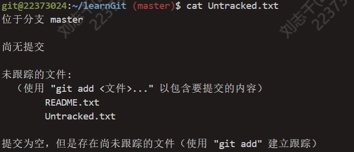
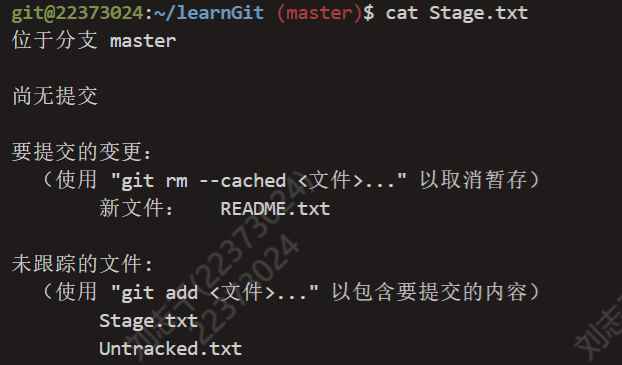
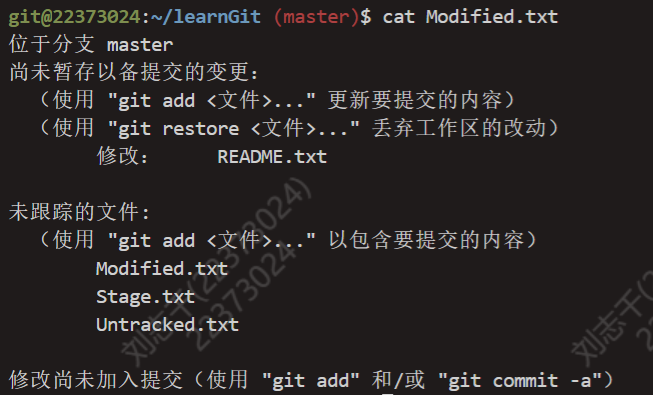
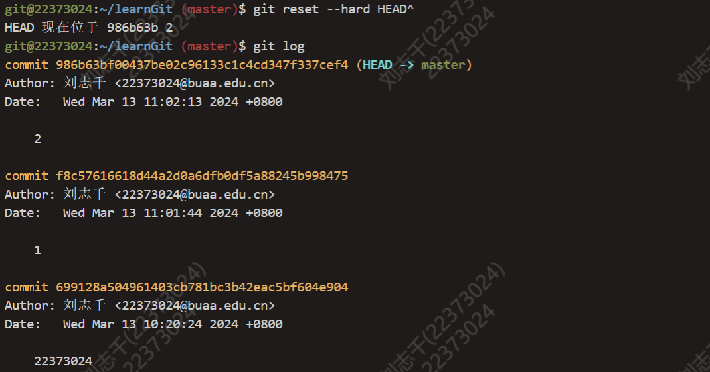
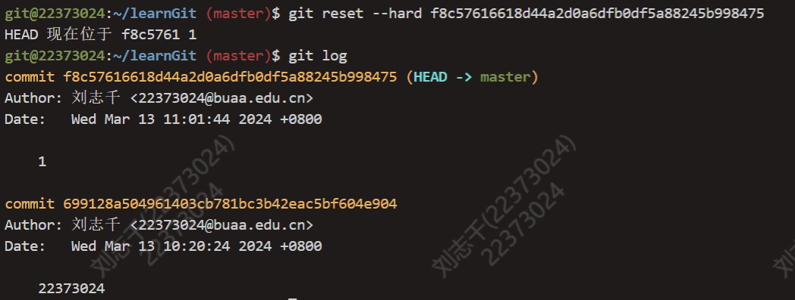
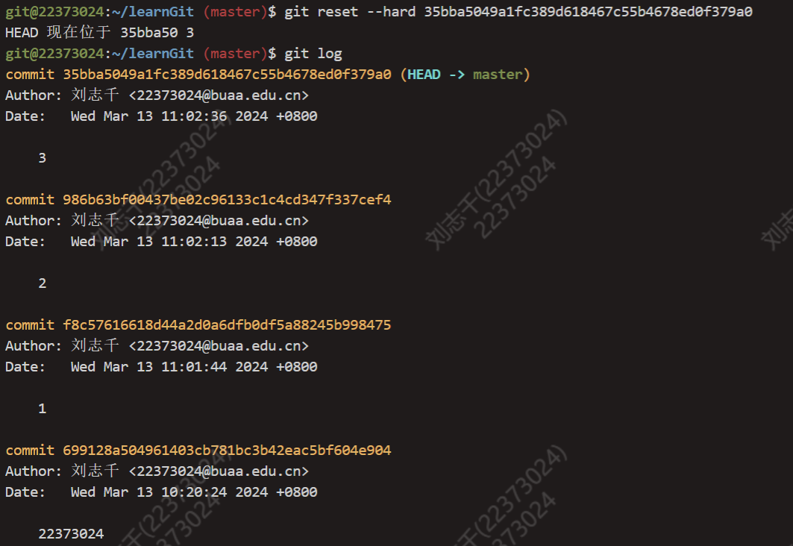

# OS_lab0实验报告

## 思考题

### Thinking 0.1 有关Git的问题



创建README.txt文件之后，该文件处于未跟踪(untracked)的状态。



对README.txt进行修改并使用add指令进行跟踪之后，该文件变为了已暂存(staged)的状态。



将README.txt文件commit之后，文件变成了未修改(unmodified)状态，再对文件内容做出改动，文件最终变成了已修改(modified)状态。

### Thinking 0.2 Git中的命令

add the file, stage the file 对应了`git add`命令 

commit 对应了`git commit`命令

### Thinking 0.3 Git撤销命令

1. 使用`git checkout -- print.c`可以将工作区中的相应文件恢复。
2. 使用`git reset HEAD print.c`将暂存区中的相应文件恢复，再使用`git checkout -- print.c`。
3. 使用`git rm --cached hello.txt`可以将暂存区的相应文件删除而不会影响工作区。

### Thinging 0.4 有关Git的问题2







可以看出，`git reset --hard HEAD^`可以让git回退到上一个版本，`git reset --hard <hash>`可以根据hash的值切换到任意一个版本。

### Thinking 0.5 重定向

执行命令之后，output.txt中只有`third`和`forth`，因为`>`会覆盖掉原来的内容，而`>>`会接着原先的内容继续追加。

### Thinking 0.6 command

command内容如下
```shell
echo 'echo Shell Start...' > test
echo 'echo set a = 1' >> test
echo 'a=1' >> test
echo 'echo set b = 2' >> test
echo 'b=2' >> test
echo 'echo set c = a+b' >> test
echo 'c=$[$a+$b]' >> test
echo 'echo c = $c' >> test
echo 'echo save c to ./file1' >> test
echo 'echo $c>file1' >> test
echo 'echo save b to ./file2' >> test
echo 'echo $b>file2' >> test
echo 'echo save a to ./file3' >> test
echo 'echo $a>file3' >> test
echo 'echo save file1 file2 file3 to file4' >> test
echo 'cat file1>file4' >> test
echo 'cat file2>>file4' >> test
echo 'cat file3>>file4' >> test
echo 'echo save file4 to ./result' >> test
echo 'cat file4>>result' >> test
```

result内容如下
```
3
2
1
```

`echo echo Shell Start`和`echo 'echo Shell Start'`都会将`echo Shell Start`当作字符串内容，直接进行输出。而`echo $c>file1`会将`$c`输入到file1文件里面，而`echo '$c>file1'`直接输出字符串`$c>file1`。

## 难点分析

lab0的实验内容主要包括了linux基本命令、Vim编辑器、GCC编译器、Makefile、Git和Shell脚本编程。在本次实验中，对我来说，编写Makefile文件和Shell脚本是两个比较大的难点。

### Makefile

在Exercise 0.4中，题目要求编写两个Makefile文件实现对`main.c`和`fibo.c`的编译。

```Makefile
# ./csc/Makefile
fibo: 
        $(MAKE) -C code
        gcc code/main.o code/fibo.o -o fibo -I ./include
clean:
        rm code/*.o

# ./csc/code/Makefile
all:fibo.o main.o
fibo.o:fibo.c 
        gcc -c fibo.c -o fibo.o -I ../include
main.o:main.c 
        gcc -c main.c -o main.o -I ../include
```

在解答这道题的时候，我遇到的问题是编译器一直找不到头文件`fibo.h`的位置，后来才了解到，使用`-I`可以设置非标准库中头文件的位置，加上这个参数之后，make指令才没有报错。  

除此之外，通过这道题，我还学会啦使用类似于`$(MAKE) -C code`的指令，使用它可以让Makefile文件在运行的时候，跳到其他目录中的Makefile文件中继续运行，这对使用make指令编译c文件提供了很大的便利。

### Shell脚本编程

还是Exercise 0.4，在第一问中，我们需要使用sed来进行文本内字符串的替换，代码如下：

```shell
#!/bin/bash
file=$1
old_word=$2
new_word=$3
sed -i "s/$old_word/$new_word/g" $file 
```

这道题中，有一个比较细节的地方，sed指令中，命令是用单引号还是双引号包括，刚开始我混淆了这个问题，后来通过查资料我才了解到，单引号中，所有的特殊字符，比如`$`不会被解释或者替换，而在双引号之中则会发生这种操作。在这道题目中，脚本需要处理输入的替换和被替换字符，因此必须使用双引号。

## 实验体会

本次实验几乎是我第一次接触并使用linux系统，同时也是我第一次大量使用命令行。在刚开始学习的时候我感觉到有一点不适应，后来在不断的练习中我逐渐掌握了lab0中的所有知识。本次实验知识内容比较杂乱，知识面涉及比较广泛，但只有掌握好这些最基础的内容，才能在之后的实验中游刃有余。

在课下实验以及课上上机的时候，我深深到了我对于grep、sed、awk等文本操作工具使用的不熟练，在课下，我会继续不断学习研究Shell脚本编程相关的知识，早日熟练掌握。